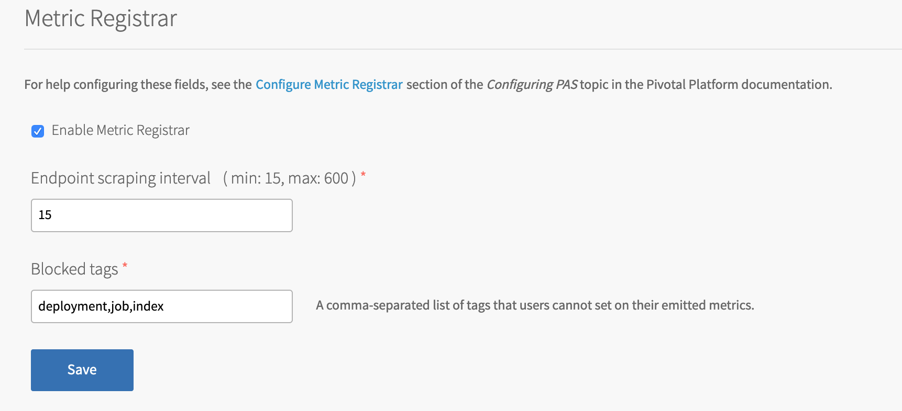

# How to monitor custom SpringBoot app metrics using PCF Metrics 1.6?

* Enable Metric Registrar in `Ops Manager > PAS > Settings > Metrics Registrar`

Refer: [Configure PAS - Metric Registrar](https://docs.pivotal.io/platform/application-service/2-8/operating/configure-pas.html#metric-registrar)

Note other configurabled fields:
* Endpoint scraping interval  min: 15, max: 600   = `35`
* Blocked tags: `deployment,job,index,id`
I removed `id` from blocked tags, reason discussed later below.




* Changes required in SpringBoot app are

  * pom.xml

Assuming actuator is enabled already, include micrometer prometheus endpoints

```
<!-- Micrometer Prometheus registry -->
<dependency>
  <groupId>io.micrometer</groupId>
  <artifactId>micrometer-registry-prometheus</artifactId>
</dependency>
```

  * application.yml

> Change required to expose prometheus end point

```
management:
  endpoints:
    web:
      exposure:
        include: "prometheus,health"
```

Refer: [Register endpoint](https://docs.pivotal.io/platform/application-service/2-8/metric-registrar/using.html#register-endpoint)

* Need to disable security for actuator endpoints [ApplicationSecurity.java](../src/main/java/ad/example/performance/ApplicationSecurity.java)

* Build and run locally then you should see prometheus endpoint
  * http://localhost:8080/actuator
  * http://localhost:8080/actuator/prometheus

* push the app to Pivotal platform (PAS)


Next > [Customize PCF Metrics 1.6x](customize-pcf-metrics-1-6.md)

[Back to Table of Content](../README.md)
