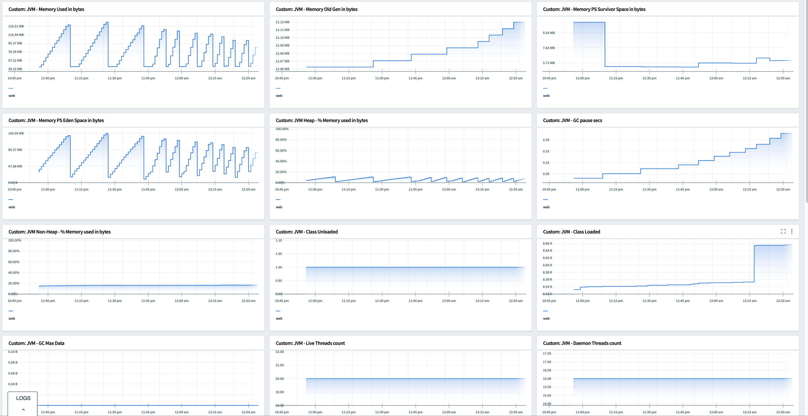

# How to configure custom metrics in PCF App Metrics 2.0?

Refer: [Steps to register metrics endpoint](https://docs.pivotal.io/platform/application-service/2-8/metric-registrar/using.html#json)

* Install plugin

```
cf install-plugin -r CF-Community "metric-registrar"
```

* Register a Public Metrics Endpoint
> Note: that the metrics endpoint gets bound to app as service instance

```
cf register-metrics-endpoint adperfsimulator /actuator/prometheus
```

* Register a Structured Log Format

```
cf register-log-format adperfsimulator json
```

* Check registered endpoints

```
cf registered-metrics-endpoints
```

PCF App Metrics 2.0.x should have been installed, which is dependent on Metrics Store.

* Create Indicator document - [pcf-metrics-indicator-doc.yml](pcf-metrics-indicator-doc.yml)

```
---
apiVersion: indicatorprotocol.io/v1
kind: IndicatorDocument

metadata:
  labels:
    deployment: "app_metrics"

spec:
  product:
    name: org,space,app-name
    version: 0.0.1

  indicators:
    - name: "JVM_Memory_PSOldGen_Indicator"
      promql: "max(max_over_time(jvm_memory_used_bytes{ source_id=\"$sourceId\" }[60s]))"
      documentation:
        title: "JVM - Memory Used in bytes"
      presentation:
        units: "bytes"
```

*   value for units:  Should be one of __none, bytes, counts, percentage, makeItAPercentage__


* Curl the doc

```
curl -vvv https://appmetrics.sys.domain/indicator-documents -k -H "Authorization: $(cf oauth-token)" --data-binary "@pcf-metrics-indicator-doc.yml"

# expect HTTP status code 200
```

Launch PCF App Metrics 2.0 and view dashboard.



* To understand the metrics and customize Promql

> View actuator end point
<https://adperfsimulator.domain>/actuator/prometheus

`cf tail adperfsimulator -c metrics -f | grep jvm_gc`

Note: for `cf tail` install plugin `cf install-plugin -r CF-Community "log-cache"`


# How to configure Multiple App metrics in single dashboard?

* Get guid of the secondary app which you want to include in your dashboard

```
cf app APP-NAME --guid
```

* Replace $sourceId with guid of the secondary app

```
- name: "HTTP_Request_Count_UI"
  promql: "sum(rate(http_total{source_id=\"edcaf4c3-0a90-55dc-8726-00b86a5e226f\"}[367s]) * 60)"
  documentation:
    title: "HTTP Request Count (per minute) - Front"
  presentation:
    units: "counts"
```

[Back to Table of Content](../README.md)
