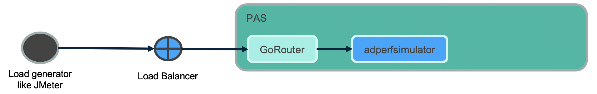

# springboot-performance-simulator
A test SpringBoot app to simulate performance by inducing latency, spiking memory usage, creating errors, etc and deploy on PCF (PAS).
This application is integrated with Spring Cloud Services - Service Registry

* Rest end-points to simulate test

__Simulate latency__

* (0 ms) <//adperformancesimulator.apps.myenv.com>/simulate/delay
* (1000 ms) <//adperformancesimulator.apps.myenv.com>/simulate/delay/1000
* (random delay) <//adperformancesimulator.apps.myenv.com>/simulate/randomdelay




__Simulate latency by hitting backend app via app using Internal domain (c2c networking)__

* (1000 ms) <//adperformancesimulator.apps.myenv.com>/a2a/delay/1000


__Simulate error__, to log errors and can be useful to test scalability of log flow

* <//adperformancesimulator.apps.myenv.com>/simulate/error

__Simulate memory__, to push app's memory usage in MB

* (1 MB) <//adperformancesimulator.apps.myenv.com>/simulate/memory
* (5 MB) <//adperformancesimulator.apps.myenv.com>/simulate/memory/5

__Simulate cpu usage__, to increase app's CPU usage

* <//adperformancesimulator.apps.myenv.com>/simulate/cpu/30 where 30 is no. of iterations of Fibonacci series.
* <//adperformancesimulator.apps.myenv.com>/simulate/cpu for 10 iterations
Observed that it can take more than 35 secs to complete one request with 100 iterations, hence limited max iterations to 75. For any input above 75, iteration will be reset to 75.


__Simulate app health check issue__

 * Include in `manifest.yml`, `health-check-invocation-timeout` in sec

 ```
 health-check-invocation-timeout: 10
 ```

 * Push app using cf7 (CF V3 API)

 ```
 cd springboot-performance-simulator
 cf7 push --vars-file=vars-myenv.yml
 ```

 * Say you configured, 10 sec timeout for your app health endpoint latency

	 To simulate latency, first hit with say 15 sec latency

	 * <//adperformancesimulator.apps.myenv.com>/health/15

	 This will ensure that <//adperformancesimulator.apps.myenv.com>/health also responds after 15 secs. At this point, expect application to crash

	 If you changed default health latency and want to reset to normal, hit below URL

	 * <//adperformancesimulator.apps.myenv.com>/health/0

 Next > [Customize PCF Metrics 1.6.x](pas-metrics/customize-pcf-metrics-1-6.md)

 [Back to Table of Content](README.md)
